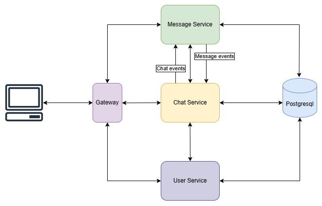
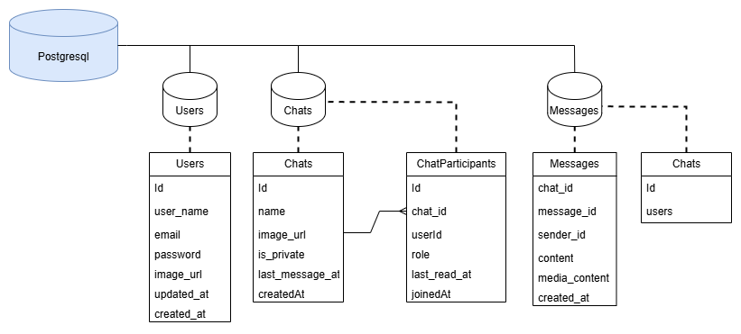

# 📱 Social service

Aplikacja społecznościowa obsługująca wiadomości, czaty oraz użytkowników.
Projekt oparty jest na architekturze mikroserwisów z wykorzystaniem Spring Boot i innych technologii takich jak
PostgreSQL, Redis i ScyllaDB.

## 🧩 Architektura



### Główne komponenty:

- **Gateway service**

Punkt wejścia dla użytkowników. Obsługuje REST / WebSocket i przekazuje żądania do odpowiednich usług.

- **User service**

Zarządza danymi użytkowników (logowanie, rejestracja).

- **Chat service**

Zarządza tworzeniem i obsługą czatów.

- **Message service**

Zarządza wysyłką i przechowywaniem wiadomości.

### 🚀 Uruchomienie lokalne

```bash
  docker-compose up -d
```

### 📦 Struktura projektu

```
social-service/
├── user-service/
├── chat-service/
├── message-service/
├── gateway-service/
├── shared-lib
└── docker-compose.yml
```

### 📡 API i komunikacja

REST – komunikacja wewnętrzna i zewnętrzna

WebSocket / STOMP + RabbitMQ – przesyłanie wiadomości w czasie rzeczywistym

RabbitMQ - przesyłanie eventów między serwisami

Redis – cachowanie danych o chatach

### 🗃️ Model danych

- **ScyllaDB**

Wysokowydajne przechowywanie wiadomości.

- **PostgreSQL**

Przechowywanie danych o użytkownikach i czatach.

