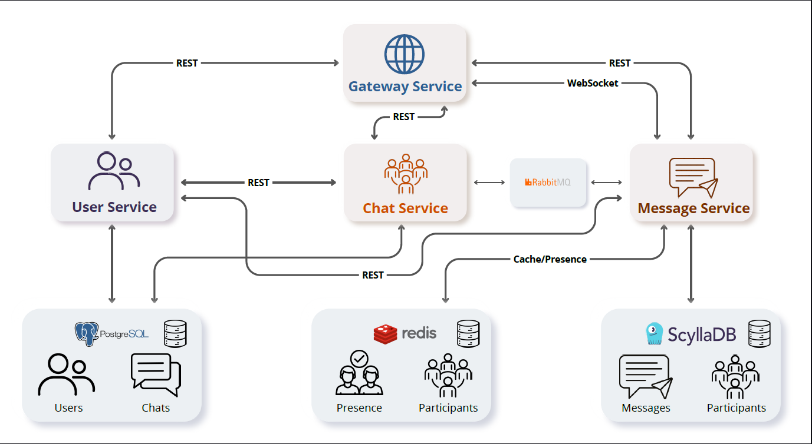

# 📱 Social service

Nowoczesna, skalowalna platforma społecznościowa oparta na architekturze mikroserwisów. System umożliwia komunikację w
czasie rzeczywistym, zarządzanie profilami użytkowników oraz obsługę dynamicznych czatów z wykorzystaniem zaawansowanych
mechanizmów bazodanowych i kolejkowych.

## 🧩 Architektura



### 🏗️ Główne komponenty:

- **Gateway service**

Centralny punkt wejścia (API Gateway) obsługujący ruch REST oraz połączenia WebSocket. Odpowiada za routing do
odpowiednich mikrousług.

- **User service**

Zarządzanie cyklem życia użytkownika – rejestracja, uwierzytelnianie oraz przechowywanie danych profilowych.

- **Chat service**

Logika biznesowa dotycząca tworzenia grup, zarządzania pokojami czatów i relacjami między uczestnikami.

- **Message service**

Serce komunikacji. Odpowiada za wysyłkę wiadomości, śledzenie statusu obecności oraz trwałe składowanie historii rozmów.

### 🛠️ Tech Stack

- ***🧠 Backend & Core***

**Java / Spring Boot**: Główny framework dla mikrousług.

**Spring Cloud Gateway**: Zarządzanie ruchem i bezpieczeństwem brzegowym.

**RabbitMQ**: Message Broker obsługujący komunikację między serwisami (Event-driven) oraz przesyłanie wiadomości w
czasie rzeczywistym (STOMP).

- ***🗃️ Data Persistence***

**PostgreSQL**: Przechowywanie danych relacyjnych (użytkownicy, struktura czatów).

**ScyllaDB**: Rozproszona baza danych NoSQL o niskich opóźnieniach, dedykowana do przechowywania ogromnych ilości
wiadomości.

**Redis**: Szybki magazyn In-memory do cachowania danych o czatach oraz monitorowania aktywnych sesji użytkowników w
czasie rzeczywistym.

- ***📡 Communication Protocols***

**REST API**: Komunikacja synchroniczna pomiędzy frontendem a usługami.

**WebSocket / STOMP**: Dwukierunkowa komunikacja w czasie rzeczywistym.

### 🚀 Kluczowe Funkcjonalności

User Presence: Śledzenie statusu online/offline użytkowników przy użyciu Redisa oraz dzięki integracji WebSockets z
RabbitMQ.

Scalable History: Archiwizacja wiadomości w ScyllaDB, zapewniająca szybki odczyt historii czatu.

Microservices Orchestration: Każdy serwis jest niezależny i komunikuje się poprzez zdarzenia (Events)
oraz synchroniczne wywołania REST API

### ⚙️ Uruchomienie lokalne

```bash
  docker-compose up -d
```

### 📦 Struktura projektu

```
social-service/
├── user-service/
├── chat-service/
├── message-service/
├── gateway-service/
├── shared-lib/
└── docker-compose.yml
```